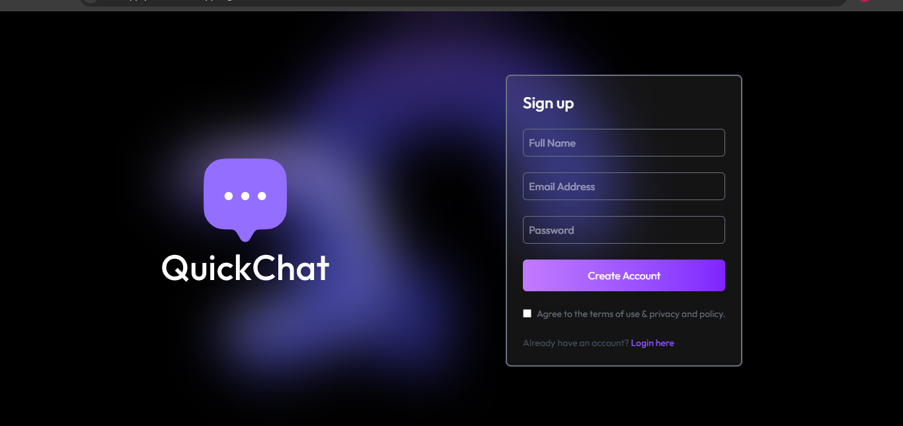
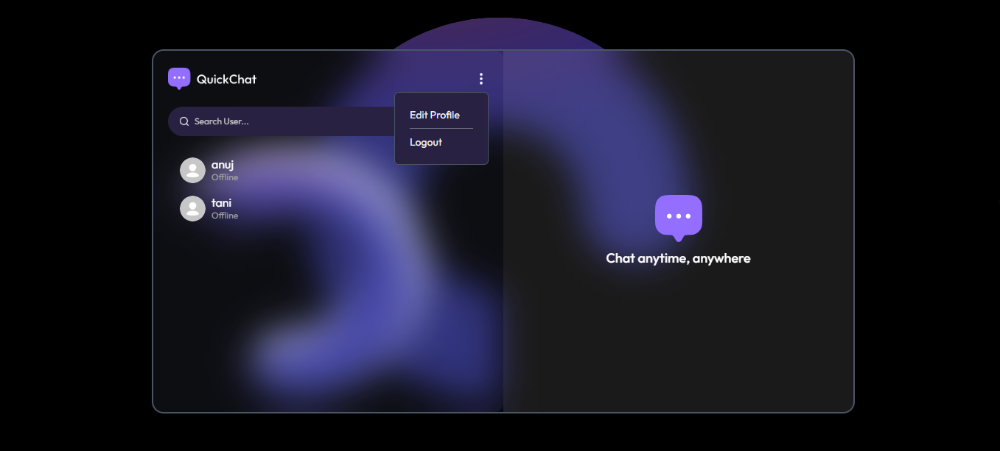
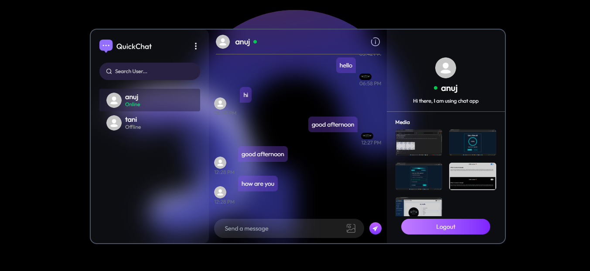

# Chat App 🚀

A real-time private chat application built with **React**, **Node.js**, **Express**, **MongoDB**, **Redis**, and **Socket.io**.  
The app supports **secure authentication, real-time messaging, typing indicators, image sharing**, and is fully **Dockerized**.

---

## Features ✨

- 🔐 User Authentication (Signup/Login) using JWT
- 💬 Real-time private chat with Socket.io
- ✍️ Typing indicators
- 🚀 Redis caching for optimized message fetching
- 🖼️ Send text & image messages
- 👤 Profile management (profile photo, bio)
- 🟢 Online / Offline user tracking
- 🔔 Unseen message notifications
- 📱 Fully responsive UI with TailwindCSS
- 🐳 Docker & Docker Compose support

---

## Tech Stack 🛠️

| Frontend              | Backend         | Database | Others                         |
|----------------------|-----------------|----------|--------------------------------|
| React.js             | Node.js         | MongoDB | Socket.io                      |
| React Router         | Express.js      | Mongoose| Redis (Message Caching)        |
| TailwindCSS          | JWT Auth        |          | Cloudinary (Image Upload)      |
| React Context API    |                 |          | Docker & Docker Compose        |
| Axios                |                 |          | React Hot Toast                |

---

## Getting Started 🏃‍♂️

### Prerequisites

- Node.js v18+
- Docker & Docker Compose
- MongoDB (local or Atlas)
- Redis
- Cloudinary account

---

## Local Setup (Without Docker)

### 1️. Clone the repository
```bash
git clone https://github.com/kaushal9643/chat-app.git
cd chat-app

2. **Install dependencies**
- Frontend

cd client
npm install

- Backend
cd ../server
npm install
```

3. **Create .env files**
- Client (client/.env)
```
VITE_BACKEND_URL=http://localhost:5000
```
- Server (server/.env)
```
PORT=5000
MONGODB_URI=your_mongodb_uri
JWT_SECRET=your_jwt_secret
CLOUDINARY_CLOUD_NAME=your_cloud_name
CLOUDINARY_API_KEY=your_api_key
CLOUDINARY_API_SECRET=your_api_secret
REDIS_URL=your_redis_url
```
## Deployment 🌐

The frontend and backend can be deployed on **Vercel** or any cloud hosting platform.  

## Screenshots 🖼️

### Chat UI


### Profile Page


### Media Sharing


## Live Demo 🌐

Check out the app here: [Chat App Live Demo](https://chat-app-psi-silk.vercel.app)
 -->
